@slog=curtin-2024
@title=Curtin CTF 2024 Writeups
@tags=ctf,2024
@date=1728790038

<!-- Junko's Markdown Renderer - Portable Version -->
<style>
font {
    font-family: Terminus;
}

* {
    font-family: Terminus;
}
</style>
<!--  -->

<div style="text-align: center">
<b>This is a writeup for Curtin CTF 2024 for the team [<i> N4S1L3M4K </i>]</b> <br/>
</div>
Since it is a 24 hours CTF, and I haven't slept yet <i>(as of this writing)</i>, there will be some mistakes, but it should be generally right.


# Warmup
## Inziption
```
Defense in Depth is the foundation for robust security, layering protection to deter even the most persistent threats. But what happens when there’s a leak in the armor? Can the sheer depth of protection save the day?

md5sum: c19da4010ecc2f0f734fca5f5c021ec0 sha1sum: a5a3b3a31b7a5b7ecc77dd588daef9594826c42d Author: @flabby
```
``` Files: file100.zip ```

Opening the file, it looks like a zip inside a zip inside a zip..., a zip bomb possibly?
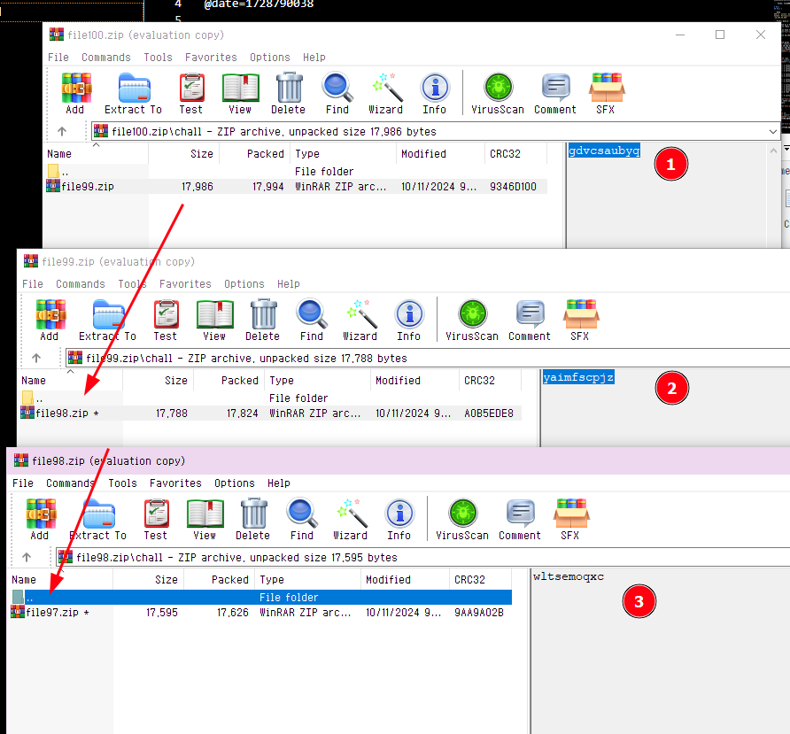
and since there's 100 of them I'm not going extract it one by one so I wrote a script. Though, I realized this after doing it for about 6 times, when I got to `file94.zip` hence why the code starts from there.
```python
import io

import pyzipper


def second(data: bytes, password: str) -> None:
    with pyzipper.AESZipFile(io.BytesIO(data)) as file:
        comment: str = file.comment.decode()
        print("ZIP Comment:", comment)

        for content in file.filelist:
            print("Extracting:", content.filename)

            if content.filename.endswith(".zip"):
                try:
                    file.extractall("out", pwd=password.encode())
                    second(file.read(content, pwd=password.encode()), comment)
                    print(f"Extracted {content.filename}")
                except RuntimeError as e:
                    print(f"Failed to extract {content.filename}: {e}")
            else:
                print(f"Skipping non-zip file: {content.filename}")


# starts at file94, because i realized extracting it manually the whole way was dumb.
zip_file_path = "file94.zip"

with open(zip_file_path, "rb") as f:
    zip_data = f.read()
    second(zip_data, "vhzygcuwrq")
```
and by the end of that zip trail, we will get this:
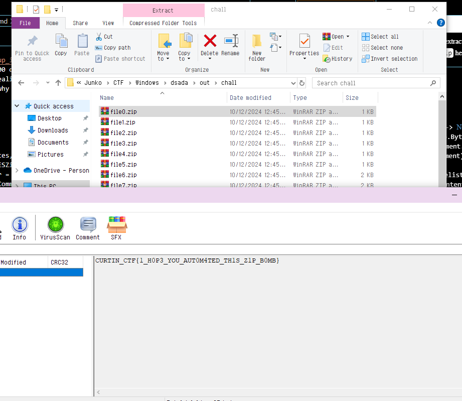
<div style="text-align: center:">

` CURTIN_CTF{1_H0P3_YOU_AUT0M4TED_TH1S_Z1P_B0MB} `
</div>

## Cracked PDF
``` 
In this file lies a secret that’s been locked away, protected by a rock solid password. But once you gain access, be careful not to let appearances deceive you. Can you see through the illusion and uncover the real message?

md5sum: ed611d39b0c6c1b63df2ecd9ef40e533 sha1sum: 1d3e1797ae53bdd8c53796ef3efe2c828a6e22ec Author: @flabby
```
``` Files: cracked.zip ```

Opening the PDF file inside the zip will give us:
<div style="text-align: center">
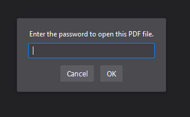
</div>

By cracking the password, we can now use `PRETTY` to open the file.

Which looks like a bunch of morse code, but we tried that and it doesn't work.

But this is where the description actually helps for once, `be careful not to let appearances deceive you`. So let's try reading it as binary.

Doing a quick `ctrl+a` `ctrl+c` from the pdf into a text editor, we can replace `.` with 1 and `-` as 0.

## CrazySignal
```
Lost in transmission, a familiar code awaits discovery. But this one wasn't sent the usual way—it’s hidden in a broadcast, distorted by a robotic signal. To recover the message, you’ll need to tune in carefully and decode what’s hidden in plain sight. Can you crack the transmission and reveal the secret

md5sum c648727fd299476d220848ac6367e95a sha1sum 95a13b689f1e2eb9c90df646d146eabd6bcb6755 Author @flabby
```
``` Files: crazySignal.zip ```

In the zip folder there is one audio file.
We can use SSTV to decode this, I'm using RX-SSTV to do it.

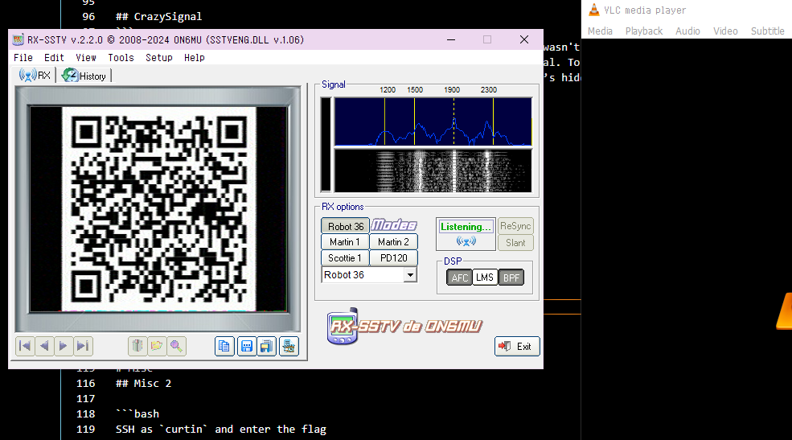

The flag is inside the QR code which is:
<div style="text-align: center">

` CURTIN_CTF{SP4C3_EXPL0RERS_MU5T_KNOW_AB0U7_SSTV} `
</div>

## IHeader
```
I received this secret message from a friend, however it looks like someone has tampered with structure of this image. What could this secret message be?

md5sum: 47a2c9c20500fe6227a8b27eff23becd sha1sum: fcf9814ec18acfc9b7a98d944a7a4fc7a1d98b21 Author: @flabby
```
``` Files: iHeader.zip ```

Inside the zip is one broken `header.png` picture.

A quick look into the hex editor we can see that the data is broken, there's no `AAAA` in PNG spec, so I assumed it's `IHDR` (comparing to other normal pictures I had).
<div style="text-align: center">
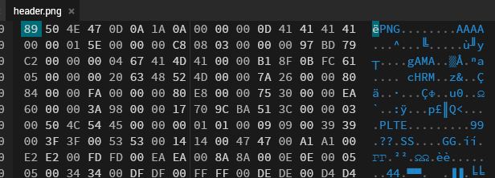
</div>

Replacing that still results in a broken image, but it turns out there's another out-of-spec header, which is `BBBB`. Replacing that with `IDAT` (considering there isn't one at all in the image) seems to fix the picture.
<div style="text-align: center">
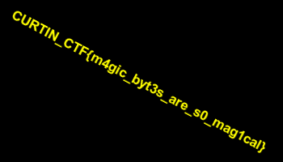

` CURTIN_CTF{m4gic_byt3s_are_s0_mag1cal} `
</div>


# OSINT
## Car on Fire Part 1
```
Owner of the car?

Flag Format: CURTIN_CTF{Firstname_Lastname}

Author: RDxR10
```
``` Files: car_on_fire.mp4 ```

The file, like the name suggests, is a video of a Tesla car being on fire. Taking a screenshot from the video and doing a reverse-image search leads up to an article.

<div style="text-align: center">


` CURTIN_CTF{Michael_Norris} `
</div>

## Car on Fire Part 2
```
What kind of air filter does the car come equipped with?

NOTE: Separate the words with underscores

Author: RDxR10
```

From the previous article, we get to know that the car is a Tesla Model S.

And from that, a quick google search will give us, `HEPA (High-Efficiency Particulate Air)`.

<div style="text-align: center">

` CURTIN_CTF{high_efficiency_particulate_air} `
</div>

## Car on Fire Part 3
```
VIN of the car?

Author: RDxR10
```

By painstakingly looking at video closely, we can get the number plate.

Which is `6WZU104`, then I'm using [[this website]](https://www.vehiclehistory.com) to get the vehicle VIN.

<div style="text-align: center">


` CURTIN_CTF{5YJSA1DP9CFP02519} `
</div>

## Can on Fire Part 4
```
Name the food store near which the car was spotted.

NOTE: Replace spaces with underscores.

Author: RDxR10
```

From the article we know the location of where it happened, which is somewhere on `Santa Monica Blvd`.
<div style="text-align: center">

</div>

So now, the only thing I need to look for is the landmark or something that uniquely identifies the place.
<div style="text-align: center">


</div>

<div style="text-align: center">

Which, narrowed it down to [[here]](https://www.google.com/maps/@34.090877,-118.3593643,3a,18.6y,267.21h,92.1t/data=!3m10!1e1!3m8!1sohWv0b-fZTW9-0C_F-PhjA!2e0!6shttps:%2F%2Fstreetviewpixels-pa.googleapis.com%2Fv1%2Fthumbnail%3Fcb_client%3Dmaps_sv.tactile%26w%3D900%26h%3D600%26pitch%3D-2.095035352216641%26panoid%3DohWv0b-fZTW9-0C_F-PhjA%26yaw%3D267.2067485077798!7i16384!8i8192!9m2!1b1!2i36?coh=205410&entry=ttu&g_ep=EgoyMDI0MTAwOS4wIKXMDSoASAFQAw%3D%3D), and so we can answer the question.
</div>

<div style="text-align: center">
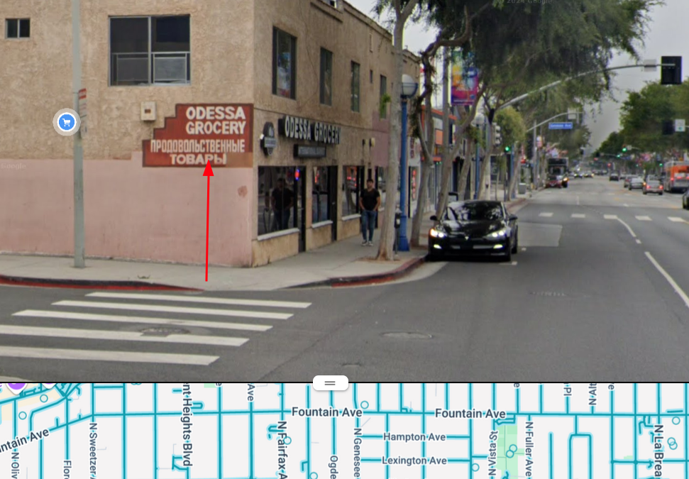

` CURTIN_CTF{Odessa_Grocery} `
</div>


# Crypto
## RSA 1
```
Sohan, the infamous crook, was finally caught and thrown into prison. There, he unexpectedly encounters Officer Kartik, who turns out to be his childhood friend.

Kartik hands him a puzzle and says, "If you solve this, I promise I’ll let you out."

Help Sohan in his bid for freedom.
```
``` Files: chall.txt, close_up_rsa_1.py ```

From the code, we can guess how to reverse the method used:
```python
p, q = gen_primes(4096, 9998)
n = p * q
phi = (p - 1) * (q - 1)
e = 65537
d = pow(e, -1, phi)
m = b'REDACTED'
c = pow(bytes_to_long(m), e, n)

print(f"n = {n}")
print(f"|p - q| = {abs(p - q)}")
print(f"c = {c}")
print(f"e = {e}")
```
From the past writeup I've seen and some researching, this is what I came up with:

```txt
n = 15940880393081622192223979546417668454241001094105696491631845740319699779637868921818468662546538526734159459987929569646758157949726050092327261607567477210838728560641007932591472048341979229227000996158864820326472140369536128940011407532021392192858059263128347413516277627338557773943130473619144266602819768289316894685127758747023625922861716983808957650638526747245869728390450745710053889903365620164261097827034696518433301946463145635387673172039280459108906156350531065067336803176395966402871830286192577088734549689317831281599635132619523883607065807674352024907150268276243231669001306391571889664767000269740644816918518242783451143038482044617197372383969811690923359599584060183246684500682839727818817572623643916667956119711025923398568092705131007640437009630310461215618002687681148614450537994685732723364660314199425405823518030479379304998927941434491041698761309565206754369009655472934744341914827525943272586954251730078614382895749955996740380235107223902027659741996429282861891673085104147370045405961294099732979678272773826599016536412578932433904030505154999176517839833260039964597955076704762201524866516857761405360622930516491985930417948661249000621996356980915282995033583482641405828363443819241154399820186471985527636315446103596671058367866892705878909337399021378085620148416281726544652130913248870503306604860069279648074721897994731666127511897571565176702890871406233528233764474842435353662824803774230985170155102399526678113553185926581547531929458018714491649785151228464354683945162919888238078818142664891976580283043168793532818976641325908588559452360271093536728188468093955635851427400246135873082132120043700880049057114037825152222836929555281795129395718413678801035220085447886467326801984191156595256589818613913229363820848876188943510988155897845879797538033623007410622942705920928531297122355664722115432967894109638655871697467544954570368089729236699347314122966944234115811880321161988925755790917881868951745905665036446036114588885458572324261723207406410695928509493222079503841942661183609924325963288751971513447161960665796967979143891190229029219582316717531133448823477925219559046895187452616687163842512991459142565797945381440167111698245672180570103015392203883682050472726311220309044957019444576289519199490560422919525648997774693485847722051397914538064633576600336792092599951404116951597102344146970626745993023933325515868962556368207329326367871452331540970273987458930797
|p - q| = 19446185665001932891863123565802286467991322014746876964013701369322897657444386633296616696168267366199920908214861667183967127865711481276497998516475134987986234107252897362882360257060819274323493441003279977951185789618655911147638408200310708832863210179986939189277431934841758094681397206297269204946733155416228404475101349159647712893882998644638490972589384447685758296695943696378904740865372847834754012806961145339009705107364366305272446432151468385174168203082509791808125524328759572433089974565599380134406580709133277810467919601298087724371283440367928548920207922728843966255605792638884428157104036042309966679145466135156678157063068138401063208639819013053445933650327463224033606491166029807779049310851321687425814592777852113728121194401684278386654197915094379386331968569071047319013960290729128040322044194139995761548185543015779153245806933487262288281397595328529970986231707560121231845029590674493616017456787804838794787286983295028461473824879025799162116310309820208035189596601045522614202811245581151461360787349910512422879586756376900659196002122475214220004775212001355945966793757926005189263687454876821065812893701132511947238001771844876788216681670235849206704991988163485611260844
c = 8413782726461541602913756039758305440836412287813773153411365960748450871027707633874217383295383481869325038078976781015007513229347097469371279220803204983355347655683513667088588074202501147594395702282334179124794781871517260250525536908326800965888418964918694916006884537543011229484376018147268919406195055917084790592479499766734576144082810933280877054789971671533919533660158408423424185650356318518379636823750893726233499500188843692055868151249687738386488534142892831049124956774899410006084346138710056812199825326206688966306714260750975121581835353985336980114774232067155041193198180698246403870169981563849307541955386369149422881602494929264929737280150329566903466285149020311618967791172538171280546694675534389454765543724780546918668435019028064871754691532110565068615157319889820944033048902255664642773218099048574566017181575258546758883546492803137717155881557338843592209207689463957840581945426930837246385901477752907096376004160861031244782814843210961453696657150665127977305005202771961236999129828758134510593378918560947499235704939556050322382009751568420207568808891407979608313803205850457374203809188547053115181776254415319188681883447021017869446867989346915152852825019616081716802990396062469163243135351547702156800537851107924720649180003285840914409777322049074094783843649569729539066223970441125382806118498958261540756052860910490399082824953032938402516792174368475134992760224198700374390864316120110306938158921418121457620889268565760685238892212999604146465162867640041064499228386006681717471251254990717858562759770905947269460142594521881470262940835078829442425244723815621278919162516682158822798977763435125635963668626156334114464102838126493966355609183208192998531373143867887346353211910003642658203653385244836610494653921249974400825401880566797287387115572727756785284767721336001760816036988439334050351608229131590077522439493925221375259909629016262905916790128638258322194247479997220390050492289058204485034457313809723675617094812771640112394720404929279053643210561537233165368292934623525915746720648655418268587097359836671508455239599508020030055462133024501888962745878358260116256538476487838862369689123290204371877250090186672449934183327283618423893439031497798985471835874040738044268676828950640266922716836786100999406935131991385114491269400938094956780725144002766875279228699473643314965832833403460993564655225664279717054432748451778401574414898003066402168353796733750757
e = 65537
```
```python
import math
from Crypto.Util.number import long_to_bytes


def reverse_rsa(n, diff, c, e):
    discriminant = diff**2 + 4 * n
    sqrt_disc = int(math.isqrt(discriminant)) 
    p1 = (diff + sqrt_disc) // 2
    p2 = (diff - sqrt_disc) // 2
    p = max(p1, p2)
    q = p - diff
    phi = (p - 1) * (q - 1)
    d = pow(e, -1, phi)
    m = pow(c, d, n)

    return long_to_bytes(m)


n = 159408...
diff = 19...
c = 8413782...
e = 65537

m = reverse_rsa(n, diff, c, e)
print(m.decode("utf-8", errors="ignore")) 
```

<div style="text-align: center">

# FLAG HERE, TODO RUN IN DEV ENV
</div>

## RSA 2
```
Things get so intense on close up...but who cares?

Sejal and Sindu, close friends, agree that observation skills won't be necessary for this.
```
``` Files: chall.txt, close_up_rsa_2.py ```

Like before, we can guess work the decryption method until it works, and at the end this is what I got.

```txt
n = 38851370026688292718610500714047313275568128923880406032240694321386868708669715834849444005885071039350867771015411960409482332075714895130040955721609469707712307896329759118786126795971608203356413095211390559788430050833157008379312765193252778797982267208761085870346676464332871683194405356959302337269
c = 10261077771725074705657914043269356567599143194523440913396849942218293691678585398731563393613698000832185314817454466653490727661933561044428403796426278758420015350118130960938311896749919783987826137481434137155805830348623564782373093651077789955010753791725635501759033479236281331100713235218526738970
e = 65537
```

```python
from Crypto.Util.number import long_to_bytes
from sympy import factorint


def decrypt(n, c, e):
    factors = factorint(n)
    p, q = list(factors.keys())

    phi_n = (p - 1) * (q - 1)
    d = pow(e, -1, phi_n)
    m = pow(c, d, n)

    return long_to_bytes(m)


n = 38851370026 ....
c = 10261077771 .....
e = 65537

decrypted_message = decrypt(n, c, e)
print(decrypted_message)
```

<div style="text-align: center">

# FLAG HERE, TODO RUN IN DEV ENV
</div>

## Dance of the stream
```
Row, row, row your boat, gently down the stream...

Author: RDxR10
```
``` Files: ciphertext.txt, o_nonce, challenge.py ```

Reading from the code (and the classes), it seems that there really isn't any way of doing it (afaik) with O(1), so I had to bruteforce it.
```python
def main():
    nonce = random.getrandbits(64)
    message = b'REDACTED'
    prng = PRNG(random.randint(1, 9999999999999999999999999999999999999999999999))
    prng_key = prng.get_bytes(2)
    encrypted_message = stream_e(prng_key, nonce, message)
    with open("ciphertext.txt", "wb") as f:
        f.write(encrypted_message)
    
    o_nonce = o_value(struct.pack("<Q", nonce))
    with open("o_nonce.txt", "wb") as f:
        f.write(o_nonce)
```

This is what I ended up with:
```python
import struct

ROUNDS = 20


def o_value(value):
    o_kie = b"leomessi"
    return bytes([b ^ o_kie[i % len(o_kie)] for i, b in enumerate(value)])


def recover_nonce(o_nonce):
    return struct.unpack("<Q", o_value(o_nonce))[0]


def q_r(a, b, c, d):
    a = (a + b) & 0xFFFFFFFF
    d = (d ^ a) << 16 | (d ^ a) >> (32 - 16)
    c = (c + d) & 0xFFFFFFFF
    b = (b ^ c) << 12 | (b ^ c) >> (32 - 12)
    a = (a + b) & 0xFFFFFFFF
    d = (d ^ a) << 8 | (d ^ a) >> (32 - 8)
    c = (c + d) & 0xFFFFFFFF
    b = (b ^ c) << 7 | (b ^ c) >> (32 - 7)
    return a, b, c, d


def stream(key, nonce, counter):
    state = [0] * 16
    state[0] = 0x61707865
    state[1] = 0x3320646E
    state[2] = 0x79622D32
    state[3] = 0x6B206574
    state[4:6] = struct.unpack("<2L", key + b"\x00" * 6)
    state[6:8] = [0] * 2
    state[8:12] = [0] * 4
    state[12] = counter
    state[13] = nonce & 0xFFFFFFFF
    state[14] = (nonce >> 32) & 0xFFFFFFFF
    state[15] = 0

    working_state = state[:]
    for _ in range(ROUNDS // 2):
        working_state[0], working_state[4], working_state[8], working_state[12] = q_r(
            working_state[0], working_state[4], working_state[8], working_state[12]
        )
        working_state[1], working_state[5], working_state[9], working_state[13] = q_r(
            working_state[1], working_state[5], working_state[9], working_state[13]
        )
        working_state[2], working_state[6], working_state[10], working_state[14] = q_r(
            working_state[2], working_state[6], working_state[10], working_state[14]
        )
        working_state[3], working_state[7], working_state[11], working_state[15] = q_r(
            working_state[3], working_state[7], working_state[11], working_state[15]
        )
        working_state[0], working_state[5], working_state[10], working_state[15] = q_r(
            working_state[0], working_state[5], working_state[10], working_state[15]
        )
        working_state[1], working_state[6], working_state[11], working_state[12] = q_r(
            working_state[1], working_state[6], working_state[11], working_state[12]
        )
        working_state[2], working_state[7], working_state[8], working_state[13] = q_r(
            working_state[2], working_state[7], working_state[8], working_state[13]
        )
        working_state[3], working_state[4], working_state[9], working_state[14] = q_r(
            working_state[3], working_state[4], working_state[9], working_state[14]
        )

    output = bytearray()
    for i in range(16):
        output.extend(struct.pack("<L", (working_state[i] + state[i]) & 0xFFFFFFFF))
    return output


def stream_e(key, nonce, message):
    keystream = bytearray()
    for i in range(0, len(message), 64):
        keystream.extend(stream(key, nonce, i // 64))

    return bytes([m ^ k for m, k in zip(message, keystream)])


class PRNG:
    def __init__(self, seed):
        self.state = seed
        self.update()

    def update(self):
        self.state = (self.state * 0x5DEECE66D + 0xB) & 0xFFFFFFFFFFFF
        self.state ^= self.state >> 33
        self.state = (
            self.state * 0xFF51AFD7ED558CCD + 0xC4CEB9B11F7A6F8D
        ) & 0xFFFFFFFFFFFF

    def get_bytes(self, num_bytes):
        result = bytearray()
        for _ in range(num_bytes):
            self.update()
            result.append(self.state & 0xFF)
        return bytes(result)


def main():
    with open("ciphertext.txt", "rb") as f:
        encrypted_message = f.read()

    with open("o_nonce.txt", "rb") as f:
        o_nonce = f.read()

    nonce = recover_nonce(o_nonce)

    for seed in range(1, 9999999999):
        prng = PRNG(seed)
        prng_key = prng.get_bytes(2)

        decrypted_message = stream_e(prng_key, nonce, encrypted_message)

        if decrypted_message.startswith(b"CUR"):
            print(f"Recovered message: {decrypted_message}")
            print(f"Using seed: {seed}")
            break


if __name__ == "__main__":
    main()
```
<div style="text-align: center">

``` CURTIN_CTF{g0_s0lv3_7h3_57r34m_pr0bl3m_0f_1r0d0v_n0w} ```
</div>

## Bluff
``` Files: challenge_bluff.go, enc_flag.txt ```

The code contains a somewhat readable encryption method, so we can easily bruteforce it.
```golang
func main() {
	key := make([]byte, 4)
	_, err := rand.Read(key)
	if err != nil {
		fmt.Println("Error generating key:", err)
		os.Exit(1)
	}

	flag := "REDACTED"
	enc := encrypt(flag, key)
	var encStr []string
	for _, num := range enc {
		encStr = append(encStr, fmt.Sprintf("%d", num))
	}
	fmt.Println("Encrypted Flag:", strings.Join(encStr, ", "))

}
```

End result:
```golang
package main

import (
	"fmt"
	"strings"
)

func encrypt(flag string, key []byte) []int {
	enc := make([]int, len(flag))
	for i := 0; i < len(flag); i++ {
		chunk := i / len(key)
		offset := i % len(key)
		enc[i] = (int(flag[i]) + chunk) ^ int(key[offset])
	}
	return enc
}

func decrypt(enc []int, key []byte) string {
	flag := make([]byte, len(enc))
	for i := 0; i < len(enc); i++ {
		chunk := i / len(key)
		offset := i % len(key)
		flag[i] = byte((enc[i] ^ int(key[offset])) - chunk)
	}
	return string(flag)
}

func isPrintable(s string) bool {
	for _, r := range s {
		if r < 32 || r > 126 {
			return false
		}
	}
	return true
}

func main() {
	enc := []int{66, 188, 199, 131, 75, 166, 245, 147, 87, 161, 232, 166, 114, 223, 228, 181, 118, 222, 226, 239, 115, 209, 241, 235, 63, 212, 169, 236, 65, 214, 173, 239, 59, 108} 
	for b1 := 0; b1 < 256; b1++ {
		for b2 := 0; b2 < 256; b2++ {
			for b3 := 0; b3 < 256; b3++ {
				for b4 := 0; b4 < 256; b4++ {
					key := []byte{byte(b1), byte(b2), byte(b3), byte(b4)}
					decryptedFlag := decrypt(enc, key)
					if isPrintable(decryptedFlag) && strings.HasPrefix(decryptedFlag, "CURT") {
						fmt.Printf("Key: [%d, %d, %d, %d] Decrypted Flag: %s\n", b1, b2, b3, b4, decryptedFlag)
						return
					}
				}
			}
		}
	}
}
```
<div style="text-align: center">

``` CURTIN_CTF{op3n_s3s4m3_7876598112} ```
</div>

## Tutto Bene
```
Somebody call the fire brigade!

Author: RDxR10
```
``` Files: chall.txt, challenge.py ```

This relatively easy looking challege, was in fact, not easy at all.
```python
import os, hashlib, random, binascii

flag = "REDACTED"
h = ""

for i in range(0, len(flag), 2):
    pair = flag[i:i+2]
    a = random.randint(1, 16)
    b = random.randint(1, 16)
    
    h += binascii.hexlify(os.urandom(random.randint(0, 31))).decode('utf-8')
    hash_value = hashlib.sha512(pair.encode('utf-8')).hexdigest()
    if a < len(hash_value) and b < len(hash_value) and a < len(hash_value) - b:
        h += hash_value[a:-b][::-1]
    else:
        h += hash_value[::-1]
    
    h += binascii.hexlify(os.urandom(random.randint(0, 31))).decode('utf-8')

print(h)
```

This is what I ended up with, which is half broken but it still outputs somewhat legible output:
```python
import hashlib
import itertools

# The encrypted text you have
encrypted = "..."


def generate_pairs():
    characters = "".join(chr(i) for i in range(32, 127)) 
    for pair in itertools.product(characters, repeat=2):
        yield "".join(pair)


def attempt_decrypt(encrypted):
    pairs = []
    found_pairs = set()

    for pair in generate_pairs():
        hash_value = hashlib.sha512(pair.encode("utf-8")).hexdigest()

        # Change these ranges from 16-32-64
        # But it takes time
        # and is harder to read
        for a in range(1, 16):
            for b in range(1, 16):
                if (
                    a < len(hash_value)
                    and b < len(hash_value)
                    and a < len(hash_value) - b
                ):
                    extracted_hash = hash_value[a:-b][::-1]
                else:
                    extracted_hash = hash_value[::-1]

                if extracted_hash in encrypted:
                    start_idx = encrypted.index(extracted_hash)
                    pairs.append((start_idx, pair))
                    found_pairs.add(pair)


    pairs.sort(key=lambda x: x[0])
    ordered_pairs = [pair for _, pair in pairs]
    print(ordered_pairs)


attempt_decrypt(encrypted)
```
<div style="text-align: center">
This is what I meant when I say it's hard to read.
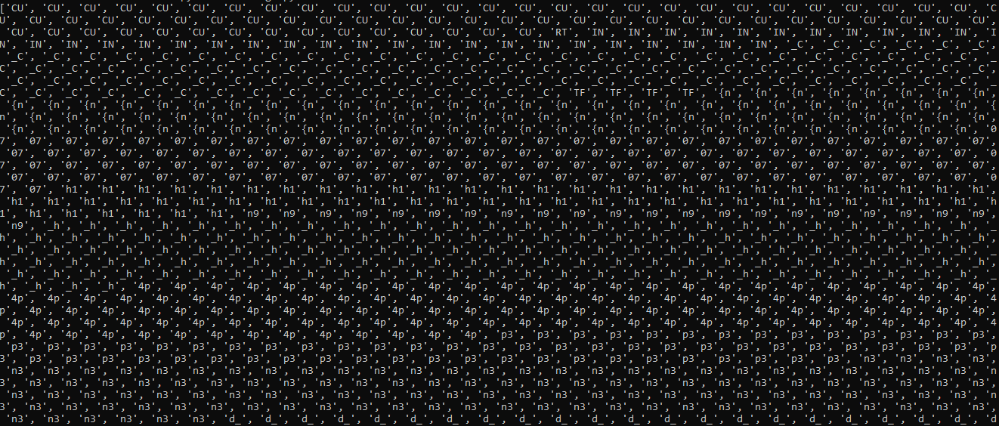

``` CURTIN_CTF{n07h1n9_h4pp3n3d_7h3_cpu_s33m5_70_b3_f1n3} ```
</div>

## Amalgam
``` Missing description  ```

This is end result we got:
```python
from sympy.ntheory import discrete_log

p = 186506814954895414068796533711441426871
g = 2
h = 128780011407215156870232600336696679553
c1 = 156581689710555992734938659724336258165
c2 = 113787733820173627914147318932861607685
x = discrete_log(p, h, g)
s = pow(c1, x, p)
s_inv = pow(s, p - 2, p)
m = (c2 * s_inv) % p
flag = m.to_bytes((m.bit_length() + 7) // 8, 'big').decode()


print(f"CURTIN_CTF{{{flag}}}")
```
<div style="text-align: center">

``` CURTIN_CTF{dlP_50lv3d:)} ```
</div>


# RE
## PinValidator
```
Unlock the app with the PIN to get the flag.

Encase the flag within: CURTIN_CTF{}

Author: sandhrab
```
``` Files: CurtinPinValidate.zip ```

A quick glance at the file tells me that this is an `.apk` file.

After decompiling, we can look at the `MainActivity` of the program.
```kotlin
public class MainActivity extends AppCompatActivity {
    private static final String HARDCODED_PIN = "7331";
    private static final String HARDCODED_STRING = "^\"u}B~%F'\"x%bU&r%dZ'p%P&d%`%d";
    private static final int KEY = 22;
    private AppBarConfiguration appBarConfiguration;
    private ActivityMainBinding binding;
    private Button checkPinButton;
    private EditText pinInput;
    private TextView resultText;
```
```kotlin
String enteredPin = MainActivity.this.pinInput.getText().toString();
if (enteredPin.equals(MainActivity.HARDCODED_PIN)) {
    String xorResult = MainActivity.this.xorString(MainActivity.HARDCODED_STRING, 22);
    MainActivity.this.resultText.setText(xorResult);
} else {
    Toast.makeText(MainActivity.this, "Incorrect PIN!", 0).show();
}
```
```kotlin
public String xorString(String input, int xorValue) {
        StringBuilder result = new StringBuilder();
        for (char c : input.toCharArray()) {
            result.append((char) (c ^ xorValue));
        }
        return result.toString();
    }
```
With this, I can easily write a short python script to reverse the XOR algorithm used here.
```python
def xor_string(input_string, xor_value):
    result = []
    for c in input_string:
        result.append(chr(ord(c) ^ xor_value))
    return "".join(result)


# Example usage:
input_string = "^\"u}B~%F'\"x%bU&r%dZ'p%P&d%`%d"
xor_value = 22
output_string = xor_string(input_string, xor_value)
print(output_string)
```
<div style="text-align: center">

` CURTIN_CTF{H4ckTh3P14n3tC0d3rL1f3F0r3v3r} `
</div>

# Misc
## Misc 2

```bash
SSH as `curtin` and enter the flag
Author: MetaSpoilt
`18.142.44.244`
```
```Files: misc_2```

and it gave us a file, `misc_2`, which is a OpenSSH private key. This will come up a lot in `Misc` flags.

Now that we have the private key, we can easily connect to the server by: <br>
<div style="text-align: center">

```bash ssh 18.142.44.244 -i misc_2 -l curtin ```

</div>

which would gives us:
<pre><font color="#6890A2"><b>➜  </b></font><font color="#D8D5CB"><b>Misc 2</b></font> ssh 18.142.44.244 -i misc_2 -l curtin
Last login: Sun Oct 13 00:39:53 2024 from 115.135.39.169
<font color="#6890A2"><b>curtin@ip-172-31-19-125</b></font>:<font color="#D0B997"><b>~</b></font>$ 

</pre>

running `ls -lar` to search for the flag:
<pre><font color="#6890A2"><b>curtin@ip-172-31-19-125</b></font>:<font color="#D0B997"><b>~</b></font>$ ls -lar
total 56
-r-------- 1 curtin curtin   20 Oct 12 06:16 flag
-rw-rw-r-- 1 curtin curtin   24 Oct 12 06:01 1.php
-rw------- 1 curtin curtin 6563 Oct 12 05:51 .viminfo
drwx------ 2 curtin curtin 4096 Oct  5 11:53 <font color="#D0B997"><b>.ssh</b></font>
-rw-r--r-- 1 curtin curtin  807 Oct  5 11:47 .profile
drwxrwxr-x 3 curtin curtin 4096 Oct 12 05:19 <font color="#D0B997"><b>.local</b></font>
-rw------- 1 curtin curtin   20 Oct 12 05:58 .lesshst
drwx------ 2 curtin curtin 4096 Oct  5 11:55 <font color="#D0B997"><b>.cache</b></font>
-rw-r--r-- 1 curtin curtin 3769 Oct 12 05:35 .bashrc
-rw-r--r-- 1 curtin curtin  220 Oct  5 11:47 .bash_logout
-rw------- 1 curtin curtin    0 Oct 13 00:40 .bash_history
-rw------- 1 curtin curtin   62 Oct 12 16:06 .Xauthority
drwxr-xr-x 6 root   root   4096 Oct  5 19:54 <font color="#D0B997"><b>..</b></font>
drwxr-x--- 5 curtin curtin 4096 Oct 13 00:40 <font color="#D0B997"><b>.</b></font>
</pre>
<div style="text-align: left">
it's just there in the home directory, so we don't really have to do anything hard, simply 
</div>
<div style="text-align: center">

`cat flag` 
</div>
and that's it.
<pre><font color="#6890A2"><b>curtin@ip-172-31-19-125</b></font>:<font color="#D0B997"><b>~</b></font>$ cat flag
CURTIN_CTF{N0_P@TH}
</pre>

<div style="text-align: center">

` CURTIN_CTF{N0_P@TH} `
</div>

## Misc 3
```bash
SSH as curtin2 and enter the flag

Author: MetaSpoilt
18.142.44.244
```
```Files: Misc 3```

The same file as before, OpenSSH private key.

Checking for any flag in `home`.
<pre><font color="#6890A2"><b>curtin2@ip-172-31-19-125</b></font>:<font color="#D0B997"><b>~</b></font>$ echo *
1.php flag
</pre>
That's not it.
<pre><font color="#6890A2"><b>curtin2@ip-172-31-19-125</b></font>:<font color="#D0B997"><b>~</b></font>$ cat flag
Hope_you_are_enjoying_the_ctf} </pre>
Checking with `ls -lar` instead.
<pre><font color="#6890A2"><b>curtin2@ip-172-31-19-125</b></font>:<font color="#D0B997"><b>~</b></font>$ ls -lar
total 56
-r-x--x--x 1 curtin2 curtin2   65 Oct 12 03:23 <font color="#6890A2"><b>flag</b></font>
-rwxrwxr-x 1 curtin2 curtin2   24 Oct 12 05:55 <font color="#6890A2"><b>1.php</b></font>
-rw------- 1 curtin2 curtin2 6566 Oct 12 15:47 .viminfo
drwx------ 2 curtin2 curtin2 4096 Oct  5 12:08 <font color="#D0B997"><b>.ssh</b></font>
-rw-r--r-- 1 curtin2 curtin2  807 Oct  5 12:07 .profile
drwxrwxr-x 3 curtin2 curtin2 4096 Oct  6 08:36 <font color="#D0B997"><b>.local</b></font>
-rw------- 1 curtin2 curtin2   20 Oct 12 12:32 .lesshst
-rw-rw-r-- 1 curtin2 curtin2    0 Oct 12 03:17 .flag
drwx------ 4 curtin2 curtin2 4096 Oct 12 12:26 <font color="#D0B997"><b>.config</b></font>
drwx------ 2 curtin2 curtin2 4096 Oct  5 12:08 <font color="#D0B997"><b>.cache</b></font>
-rw-r--r-- 1 curtin2 curtin2 3768 Oct  5 12:08 .bashrc
-rw-r--r-- 1 curtin2 curtin2  220 Oct  5 12:07 .bash_logout
-rw------- 1 curtin2 curtin2    0 Oct 13 01:07 .bash_history
drwxr-xr-x 6 root    root    4096 Oct  5 19:54 <font color="#D0B997"><b>..</b></font>
drwxr-x--- 6 curtin2 curtin2 4096 Oct 13 01:07 <font color="#D0B997"><b>.</b></font></pre>
This doesn't seem right, so I'm just gonna copy the whole directory just in case.
<pre><font color="#D3BC6C"><b>➜  </b></font><font color="#D8D5CB"><b>Misc 3</b></font> scp -r -i misc_3 curtin2@18.142.44.244:~ home_copy
.viminfo                                                          100% 6566   168.4KB/s   00:00    
.bashrc                                                           100% 3768   100.9KB/s   00:00    
flag                                                              100%   65     1.8KB/s   00:00    
1.php                                                             100%   24     0.7KB/s   00:00    
.bash_logout                                                      100%  220     6.1KB/s   00:00    
.lesshst                                                          100%   20     0.6KB/s   00:00    
htoprc                                                            100% 1669    45.3KB/s   00:00    
.profile                                                          100%  807    21.9KB/s   00:00    
authorized_keys                                                   100%   82     2.3KB/s   00:00 </pre>
Oh!
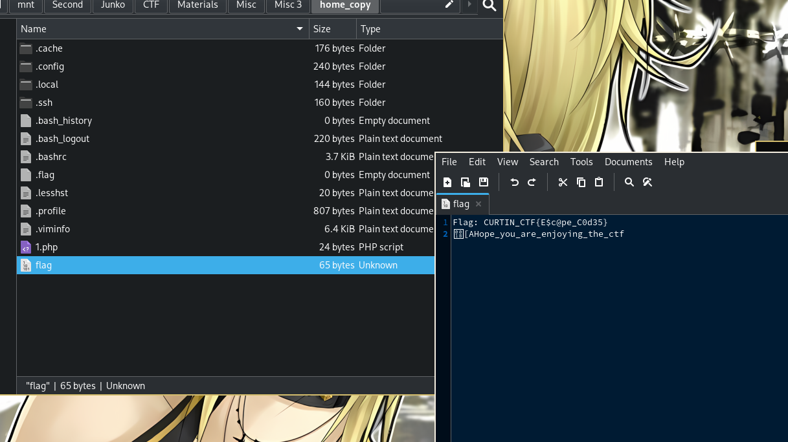
<div style="text-align: center">

` Flag: CURTIN_CTF{E$c@pe_C0d35} `
</div>

## Misc 4
```
SSH as curtin3 and enter the flag

Author: MetaSpoilt
18.142.44.244 
```
``` Files: misc_4 ```

OpenSSH, you should know by now.

Like [Misc 3], I'm going to download the entire home folder again.
<pre><font color="#6890A2"><b>➜  </b></font><font color="#D8D5CB"><b>Misc 4</b></font> scp -r -i misc_4 curtin3@18.142.44.244:~ home_copy
snap-discard-ns.c                                                 100%  620    16.7KB/s   00:00    
snap-update-ns                                                    100%   26KB  75.5KB/s   00:00    
.viminfo                                                          100% 7781    44.9KB/s   00:00    
pspy64                                                            100% 3032KB 446.2KB/s   00:06    
view_flag1.sh                                                     100%   52     1.5KB/s   00:00    
view_flag3.sh                                                     100%   45     1.3KB/s   00:00    
view_flag.sh                                                      100%   31     0.9KB/s   00:00    
.bashrc                                                           100% 3768    96.8KB/s   00:00    
trustdb.gpg                                                       100% 1200    24.3KB/s   00:00    
pubring.kbx                                                       100%   32     0.2KB/s   00:00    
.bash_logout                                                      100%  220     6.5KB/s   00:00    
.Xauthority                                                       100%   62     1.0KB/s   00:00    
flag                                                              100%   26     0.8KB/s   00:00    
.profile                                                          100%  807    23.0KB/s   00:00    
known_hosts                                                       100%  142     4.1KB/s   00:00    
authorized_keys                                                   100%   81     2.4KB/s   00:00    
</pre> 
Listing the files:
<pre><font color="#6890A2"><b>➜  </b></font><font color="#D8D5CB"><b>home_copy</b></font> ls -lar          
total 3057
-rwxrwxrwx 1 root root      62 Oct 13 20:27 <font color="#6890A2"><b>.Xauthority</b></font>
-rwxrwxrwx 1 root root    7781 Oct 13 20:27 <font color="#6890A2"><b>.viminfo</b></font>
drwxrwxrwx 1 root root       0 Oct 13 20:27 <span style="background-color:#6890A2"><font color="#D0B997">.ssh</font></span>
-rwxrwxrwx 1 root root 3104768 Oct 13 20:27 <font color="#6890A2"><b>pspy64</b></font>
-rwxrwxrwx 1 root root     807 Oct 13 20:27 <font color="#6890A2"><b>.profile</b></font>
drwxrwxrwx 1 root root       0 Oct 13 20:27 <span style="background-color:#6890A2"><font color="#D0B997">.Private</font></span>
drwxrwxrwx 1 root root       0 Oct 13 20:27 <span style="background-color:#6890A2"><font color="#D0B997">.local</font></span>
drwxrwxrwx 1 root root       0 Oct 13 20:27 <span style="background-color:#6890A2"><font color="#D0B997">.gnupg</font></span>
-rwxrwxrwx 1 root root       0 Oct 13 20:27 <font color="#6890A2"><b>flag.txt</b></font>
drwxrwxrwx 1 root root       0 Oct 13 20:27 <span style="background-color:#6890A2"><font color="#D0B997">bin</font></span>
-rwxrwxrwx 1 root root    3768 Oct 13 20:27 <font color="#6890A2"><b>.bashrc</b></font>
-rwxrwxrwx 1 root root     220 Oct 13 20:27 <font color="#6890A2"><b>.bash_logout</b></font>
-rwxrwxrwx 1 root root       0 Oct 13 20:27 <font color="#6890A2"><b>.bash_history</b></font>
drwxrwxrwx 1 root root    4096 Oct 13 20:27 <span style="background-color:#6890A2"><font color="#D0B997">..</font></span>
drwxrwxrwx 1 root root    4096 Oct 13 20:27 <span style="background-color:#6890A2"><font color="#D0B997">.</font></span>
drwxrwxrwx 1 root root       0 Oct 13 20:27 <span style="background-color:#6890A2"><font color="#D0B997">-</font></span></pre>
Finding the flag, with `find`:
<pre><font color="#6890A2"><b>➜  </b></font><font color="#D8D5CB"><b>home_copy</b></font> find . -name flag
./-/flag</pre>
Finish.
<pre><font color="#6890A2"><b>➜  </b></font><font color="#D8D5CB"><b>home_copy</b></font> cat ./-/flag
CURTIN_CTF{d@$h3d_f0lder}</pre>
<div style="text-align: center">

` CURTIN_CTF{d@$h3d_f0lder} `
</div>

## Misc 5
```
SSH as ubuntu and enter the flag

Author: MetaSpoilt
54.255.1.14 
```
``` Files: misc_5 ```

OpenSSH private key, you know the deal.

Listing files:
<pre><font color="#6890A2"><b>ubuntu@ip-172-31-46-50</b></font>:<font color="#D0B997"><b>~</b></font>$ echo *
es flag flag1 john_hash.txt john_hashes.txt john_key john_shadow.txt key.txt new_key new_key.pub rootshell sad snap ubuntu ubuntu.pub unshadowed_password wtf</pre>
Reading the flag:
<pre><font color="#6890A2"><b>ubuntu@ip-172-31-46-50</b></font>:<font color="#D0B997"><b>~</b></font>$ cat flag
cat: flag: Permission denied</pre>
Unable to read, because if we check the file permission, it's only readable to `root`
<pre><font color="#6890A2"><b>ubuntu@ip-172-31-46-50</b></font>:<font color="#D0B997"><b>~</b></font>$ ls -lar
total 180
<.......... Cleaned to only show the important file ..........>
lrwxrwxrwx  1 ubuntu ubuntu     4 Oct 12 13:19 <font color="#D8D5CB"><b>flag1</b></font> -&gt; flag
-r--------  1 root   root      27 Oct 12 10:52 flag</pre>
Using `sudo -l` we can get get which binary we can use without entering `root` password.
<pre><font color="#6890A2"><b>ubuntu@ip-172-31-46-50</b></font>:<font color="#D0B997"><b>~</b></font>$ sudo -l
Matching Defaults entries for ubuntu on ip-172-31-46-50:
    env_reset, mail_badpass,
    secure_path=/usr/local/sbin\:/usr/local/bin\:/usr/sbin\:/usr/bin\:/sbin\:/bin\:/snap/bin,
    use_pty

User ubuntu may run the following commands on ip-172-31-46-50:
    (root) NOPASSWD: /bin/more</pre>
and, I was right.
<pre><font color="#6890A2"><b>ubuntu@ip-172-31-46-50</b></font>:<font color="#D0B997"><b>~</b></font>$ sudo /bin/more flag
CURTIN_CTF{$ud0_N0_P@s$wd}</pre>
<div style="text-align: center">

` CURTIN_CTF{$ud0_N0_P@s$wd} `
</div>


## Misc 6
```
nc 52.221.246.50 1337 - get bash shell

enter the flag

Author: MetaSpoilt
54.254.174.55 
```
``` Files: None ```

No file this time around, but it's the same concept, we get a shell and we need to find the flag.

Like before, we can't read the flag because we don't have the permission, so gotta find a permission escalation somehow.
<pre>ctfuser@c8ca61aeceaa:/$ ls
ls
<font color="#D8D5CB"><b>bin</b></font>   <font color="#D0B997"><b>dev</b></font>  <font color="#D0B997"><b>home</b></font>  <font color="#D8D5CB"><b>lib64</b></font>  <font color="#D0B997"><b>mnt</b></font>  <font color="#D0B997"><b>proc</b></font>  <font color="#D0B997"><b>run</b></font>   <font color="#D0B997"><b>srv</b></font>  <span style="background-color:#6890A2"><font color="#0C0C0C">tmp</font></span>  <font color="#D0B997"><b>var</b></font>
<font color="#D0B997"><b>boot</b></font>  <font color="#D0B997"><b>etc</b></font>  <font color="#D8D5CB"><b>lib</b></font>   <font color="#D0B997"><b>media</b></font>  <font color="#D0B997"><b>opt</b></font>  <font color="#D0B997"><b>root</b></font>  <font color="#D8D5CB"><b>sbin</b></font>  <font color="#D0B997"><b>sys</b></font>  <font color="#D0B997"><b>usr</b></font>
ctfuser@c8ca61aeceaa:/$ cd home/ctf
cd home/ctf
ctfuser@c8ca61aeceaa:/home/ctf$ ls
ls
flag
ctfuser@c8ca61aeceaa:/home/ctf$ cat flag
cat flag
cat: flag: Permission denied
ctfuser@c8ca61aeceaa:/home/ctf$ ls -lar
ls -lar
total 20
-r-------- 1 root root   19 Oct 12 15:08 flag
-rw-r--r-- 1 root root   55 Oct 12 15:08 .bashrc
drwxr-xr-x 1 root root 4096 Oct 12 15:08 <font color="#D0B997"><b>..</b></font>
drwxr-xr-x 1 root root 4096 Oct 12 15:08 <font color="#D0B997"><b>.</b></font>
ctfuser@c8ca61aeceaa:/home/ctf$ 
</pre>
Checking `sudo -l` doesn't seem to work.
<pre>ctfuser@c8ca61aeceaa:/home/ctf$ sudo -l
sudo -l
bash: sudo: command not found</pre>
So we gotta do it the long way:
<pre>ctfuser@c8ca61aeceaa:/home/ctf$ find / -perm -4000
find / -perm -4000
/usr/bin/chfn
/usr/bin/su
/usr/bin/chsh
/usr/bin/gpasswd
/usr/bin/umount
/usr/bin/newgrp
/usr/bin/passwd
/usr/bin/mount
find: &apos;/home/ubuntu&apos;: Permission denied
find: &apos;/root&apos;: Permission denied
find: &apos;/var/cache/ldconfig&apos;: Permission denied
find: &apos;/var/cache/apt/archives/partial&apos;: Permission denied
find: &apos;/proc/tty/driver&apos;: Permission denied
find: &apos;/proc/830/task/830/fd/6&apos;: No such file or directory
find: &apos;/proc/830/task/830/fdinfo/6&apos;: No such file or directory
find: &apos;/proc/830/fd/5&apos;: No such file or directory
find: &apos;/proc/830/fdinfo/5&apos;: No such file or directory
/etc/security/print_file</pre>
The file `/etc/security/print_file` really stood out for me, so let's try that.
<pre>ctfuser@c8ca61aeceaa:/home/ctf$ /etc/security/print_file flag 
/etc/security/print_file flag
CURTIN_CTF{$3tU1D}</pre>
<div style="text-align: center">

` CURTIN_CTF{$3tU1D} `
</div>

# Web Exploitation
## Crumb Trails
```
The website theme seems to be telling me something ...

Challenge Link: http://18.141.159.205:8002/
```

Opening the website and checking the `Network` tab gave us a clue.
<div style="text-align: center">
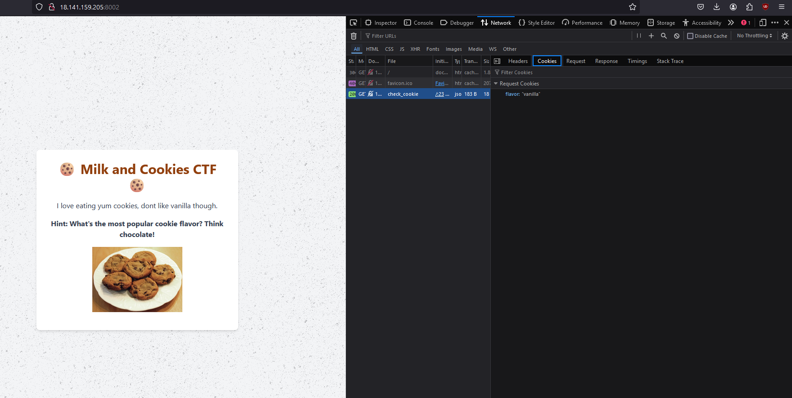
</div>
<div style="text-align: center">
Replicating the same network request in API Tester with the Cookie's flavor value being `chocolate` will give us the flag.
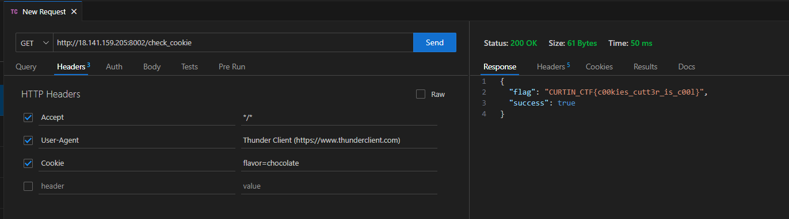

` CURTIN_CTF{c00kies_cutt3r_is_c00l} `
</div>

## Valuable Feedback
```
The author wants some feedback on the website quality, make sure to preview and send him some good reviews.

Challenge Link: http://54.255.222.103:8004/
```

The website contains a textbox which the user can submit, and it will output it back the same.

<div style="text-align: center">

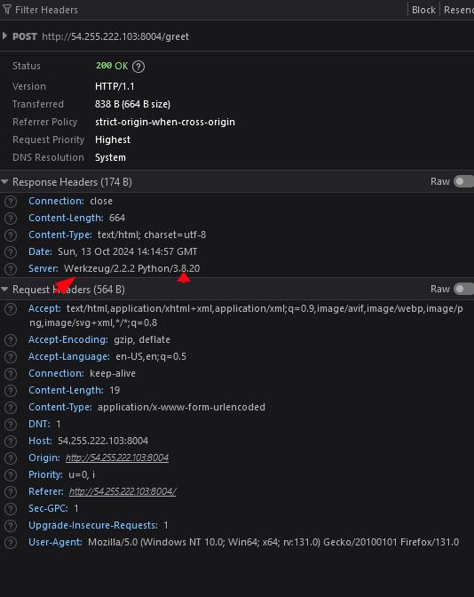

From here we can see that the server is using `Werkzeug and Python` so it's most likely running on a Flask server, which uses Jinja.
</div>

By employing a basic jinja payload to the textbox, we can get the flag:

<div style="text-align: center">
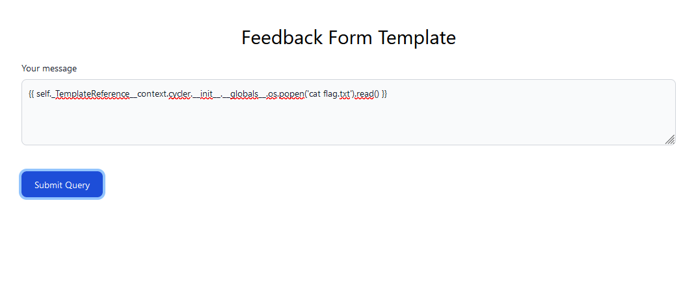
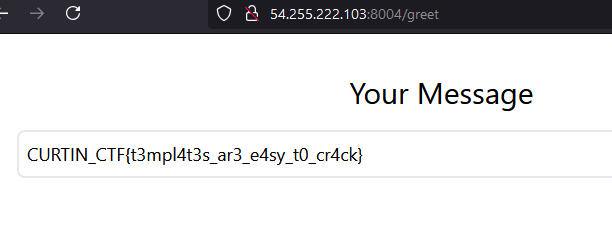

`  CURTIN_CTF{t3mpl4t3s_ar3_e4sy_t0_cr4ck}  `
</div>
